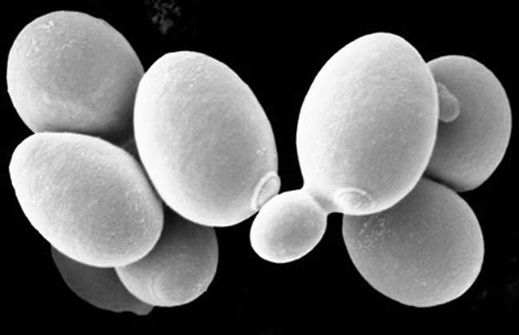

---
output:
  pdf_document: 
    pandoc_args: --highlight=breezedark
---

```{r setup, include=FALSE}
knitr::opts_chunk$set(echo = TRUE, comment=NA)
library(tidyr)
library(kableExtra)
library(ggplot2)
library(gridExtra)
library(cowplot)
library(ggpubr)
library(pander)
library(ggbiplot)
library(reshape2)
library(ggfortify)
library(ggalt)
library(ggridges)
library(cluster)
```

<!-- Copyright (c) 2022 John Busker. -->

<!-- Licensed under GPLv3. See gpl.md -->

# Cellular Localization Prediction

## Can the cellular localization Sites of proteins be predicted using probabilistic classification.




```{=tex}
\vspace*{\fill}
\begin{flushright}
John Busker\\
352905\\
Bio-Informatics\\
Dave Langers, and Bart Barnard\\
28-10-2022
\end{flushright}
```
\newpage

# Table of Contents

1. [Introduction](#introduction) \dotfill 3  

2. [Materials and Methods](#materials-and-methods) \dotfill 4  
3. [Results](#results) \dotfill 5  
  3.1 [Codebook](#codebook) \dotfill 5  
  3.2 [Machine Learning](#machine-learning) \dotfill 8  

4. [Discussion and Conclusion](#discussion-and-conclusion) \dotfill 12  
  4.1 [Discussion](#discussion) \dotfill 12  
  4.2 [Conclusion](#conclusion) \dotfill 12  
  
5. [Project Proposal](#project-proposal) \dotfill 13  

6. [References](#references) \dotfill 14

\newpage

# Introduction

Protein activities and their subcellular locations in cells are strongly connected. Finding proteins’ positions within cells is frequently the initial step in understanding them, and their sites serve as a model for medication design. The amino acid sequence of a protein mostly determines where it will localize within a cell. Using this knowledge, a software program has been developed to define a simple model for the classification of yeast localization in cells. The efficient arrangement of biological data into databases and the creation of algorithms, such as string algorithms, to manipulate that data have largely defined the area of computational biology. The dataset consists of 1484 yeast sequences from SWISS-PROT using the annotations from YPD.

Research question: How accurate can the cellular localization sites of proteins be predicted using probabilistic classification?

\newpage

# Materials and Methods

The data has been retrieved from [uci.](https://archive.ics.uci.edu/ml/datasets/Yeast) The dataset consists of 1484 yeast sequences from SWISS-PROT using the annotations from YPD. In this section, we are going to talk about the results we found from the dataset.

Yeast proteins were classified into ten classes: **cytoplasmic:** cytoskeletal (CYT); nuc]ear (NUC); vacuolar (VAC); mitochondrial (MIT); isomal (POX); **extracellular:** including those localized against the cell wall (EXC); proteins localized to the lumen of the endoplasmic reticulum (ERL); membrane proteins with a cleaved signal (ME1); membrane proteins with an uncleared signal (ME2); and membrane proteins with no N-terminal sign (ME3), where ME1, ME2,and ME3 proteins may be localized to the plasma membrane, the endoplasmic reticulum membrane, or the membrane of a golgi body.

Eight features were used in classification. Here below are all the features

-   **mcg**: McGeoch's method for signal sequence recognition.\
-   **gvh**: von Heijne's method for signal sequence recognition.\
-   **alm**: Score of the ALOM membrane spanning region prediction program.\
-   **mit**: Score of discriminant analysis of the amino acid content of the N-terminal region (20 residues long) of mitochondrial and non-mitochondrial proteins.\
-   **erl**: Presence of "HDEL" substring (thought to act as a signal for retention in the endoplasmic reticulum lumen). Binary attribute.\
-   **pox**: Peroxisomal targeting signal in the C-terminus.\
-   **vac**: Score of discriminant analysis of the amino acid content of vacuolar and extracellular proteins.\
-   **nuc**: Score of discriminant analysis of nuclear localization signals of nuclear and non-nuclear proteins.

It is always important to look at the data and to look at the quality of the data. No proper conclusion can be drawn from low-quality data. For recurrent errors, the data can be corrected. The data needs to be modified to make sure it is of the highest quality to perform the analysis on. This is achieved by performing exploratory data analysis on the dataset. Modifying and removing parts of the dataset to get the best possible dataset. A RandomForest classifier has been chosen for the classification of the unknown instances. The parameters have been optimized for usability and speed. See the [logjournal](https://github.com/AlfonsoJan/Theme9) [1].

A Java application has been developed. The software using Weka carried out the calculations required to carry out the probabilistic inference. The application can quickly classify new instances given from a file or from the command line. See the [repo](https://bitbucket.org/janalfonso/wekawrapper/) [2] for the code.

\newpage

# Results

To create a great dataset, changes need to be made to the downloaded dataset. The dataset consists of 1484 yeast sequences from SWISS-PROT using the annotations from YPD. In this section, we are going to talk about the results we found from the dataset [3].

## Codebook

As it is a large dataset, it is wise to look at the codebook first. However, there is no codebook. Nevertheless, there is a file with more information on all the attributes. This is where the information is extracted to make your own codebook.

Below is a table with a description of all the attributes' abbreviations, explanations, and data types.

```{r, echo=FALSE}
attr_names <- c("seq.name", "mcg", "gvh", "alm", "mit", "erl",
                "pox", "vac","nuc", "loc.site" )
data_types <- c("str", "double", "double", "double", "double", "double",
                "logical", "double", "double", "factor")
data_labels <- c("Accession number for the SWISS-PROT database",
                 "McGeoch's method for signal sequence recognition",
                 "von Heijne's method for signal sequence recognition",
                 "Score of the ALOM membrane spanning region prediction program",
                 "Score of discriminant analysis of the amino 
                 acid content of the N-terminal region",
                 "Presence of 'HDEL' substring",
                 "Peroxisomal targeting signal in the C-terminus",
                 "Score of discriminant analysis of the amino acid content 
                 of vacuolar and extracellular proteins",
                 "Score of discriminant analysis of nuclear 
                 localization signals of nuclear and non-nuclear proteins",
                 "The class is the localization site")
codebook <- data.frame(Name=attr_names, 
                       Fullname=data_labels, 
                       Datatypes=data_types)
kbl(codebook, booktabs = T, align = "c") %>%
  kable_styling(full_width = T) %>%
  column_spec(2, width = "10cm")
```

```{=tex}
\begin{center}
\emph{Table 1:} The codebook.
\end{center}
```
The last column is the sequence's localization site. There are ten different possibilities for this. Yeast proteins were classified into ten classes: **cytoplasmic:** CYT; NUC; VAC; MIT; POX; **extracellular:** EXC; ERL; ME1; ME2; ME3.

Here are the ten in question:

```{r, echo=FALSE}
abbrv <- c("CYT", "NUC", "MIT", "ME3", "ME2", "ME1", "EXC", "VAC", "POX", "ERL")
loc.fullname <- c("cytosolic or cytoskeletal", "nuclear", "mitochondrial", "membrane protein, no N-terminal signal", "membrane protein, uncleaved signal", "membrane protein, cleaved signal", "extracellular", "vacuolar", "peroxisomal", "endoplasmic reticulum lumen")
amount <- c(463, 429, 244, 163, 51, 44, 37, 30, 20, 5)
pander(data.frame(Abbreviation=abbrv, 
                  Fullname=loc.fullname, 
                  Amount=amount))
```

```{=tex}
\begin{center}
\emph{Table 2:} Sequence localization sites.
\end{center}
```
There are alot of CYT and NUC localizations. ERL localization is the least. There are only five of these in the dataset.

## Dataset

Eight features were used in classification: the presence or absence of an HDEL pattern as a signal for retention in the endoplasmic reticulum lumen (erl); The results of discriminant analysis on the amino acid content of vacuolar and extracellular proteins (vac); the result of discriminant analysis on the amino acid composition of the 20-residue N-terminal region of mitochondrial and non-mitochondrial proteins (mit); the presence or absence of nuclear localization consensus patterns combined with a term reflecting the frequency of basic residues (nuc); and some combination of the presence of a short sequence motif and the result of discriminant analysis of the amino acid composition of the protein sequence (pox) [3].

```{r, echo=FALSE}
data <- as_tibble(read.table("Resources/yeast.data", sep = ""))
colnames(data) <- attr_names
pander(head(data))
```

```{=tex}
\begin{center}
\emph{Table 3:} First six rows of the dataset.
\end{center}
```
As seen from the table, the loaded dataset. It has a char datatype for the first and last column. And every other column has a double datatype.

There are `r nrow(data)` rows and `r ncol(data)` columns.

```{r, fig.cap="A waffle chart of the categorical composition", fig.width=6, fig.height=3, echo=FALSE}
df <- expand.grid(y = 1:28, x = 1:53)
categ_table <- sort(table(data$loc.site), decreasing = T)
df$category <- factor(rep(names(categ_table), categ_table))
ggplot(df, aes(x = x, y = y, fill = category)) +
geom_tile(color = "black", size = 0.5) +
scale_x_continuous(expand = c(0, 0)) +
scale_y_continuous(expand = c(0, 0), trans = 'reverse') +
scale_fill_brewer(palette = "Set3") +
labs(title="Waffle Chart", subtitle="'Class' of localization") +
xlab(NULL) + ylab(NULL)
```

Figure 2 shows the number of each classification of the dataset. There are alot of CYT and NUC localization. And there are only `r nrow(subset(data, loc.site=="ERL", loc.site))` of ERL.

To ensure the quality of the data. The data had to be transformed before it could be worked with.

The first column has been dropped since it is not necessary. Since the sequence names contribute nothing to creating a prediction model.

```{r, echo=FALSE}
data <- data[, -1]
pander(head(data))
```

```{=tex}
\begin{center}
\emph{Table 4:} First six rows of the dataset with the first column dropped.
\end{center}
```
As stated on the website there are `r sum(is.na(data))` missing values. This has been confirmed using R.

```{r, echo=FALSE}
data$loc.site <- as.factor(data$loc.site)
```

It can be more convenient to have a variable in a factor form instead of numeric form. The data type of the column loc.site has been successfully changed to factors.

The ERL column has changed. from a double to a logical datatype. As seen in table 5 below, only numbers 1 and 0.5 appear, but for a logical datatype you need 1 and 0. All 0.5 have been changed to 0.

```{r, echo=FALSE}
pander(table(data$erl))
```

```{=tex}
\begin{center}
\emph{Table 5:} A table showing distrubtion of the ERL column.
\end{center}
```
```{r, echo=FALSE}
data$erl[data$erl == 0.5] <- 0
data$erl <- as.logical(data$erl)
m <- sapply(data, typeof)
m[m=="integer"] <- "factor"
pander(m)
```

```{=tex}
\begin{center}
\emph{Table 6:} Each column name and the typeof the datatype.
\end{center}
```
Each column has been changed so that it has the right data type.

At pox, vac and nuc, you don't see shifted peaks. At mcg and gvh you really see shifted peaks this shows a distribution of the different classes. There are small shifted peaks at alm en mit, this shows that there is difference but not so much.

\newpage

```{r, warning=FALSE, message=FALSE, fig.cap="Ridge line plot between mcg and gvh", echo=FALSE, fig.width=6, fig.height=6}
p1 <- ggplot(data, aes(x=mcg, y=loc.site, fill = loc.site)) + 
  geom_density_ridges2(rel_min_height = 0.005) + theme_minimal() + 
  coord_cartesian(clip = "off")
p2 <- ggplot(data, aes(x=gvh, y=loc.site, fill = loc.site)) + 
  geom_density_ridges2(rel_min_height = 0.005) + theme_minimal() + 
  coord_cartesian(clip = "off")
plot <- ggarrange(p1, p2, common.legend = TRUE)
annotate_figure(plot, top = text_grob("Ridge line plot", face = "bold", size = 14))
```

Now you can really see that the peaks are shifted.

We need to test the data to see if there is significant difference between it. Using a 1-way ANOVA test.

```{r, echo=FALSE}
# Perform a one way anova test
res.aov <- summary(aov(mcg ~ loc.site, data = data))
p.value <- res.aov[[1]]$`Pr(>F)`[1]
```

The P-value is `r p.value` \< 0.05. So there is a significant difference.

## Machine Learning

Weka was used to test which algorithm is best to use for the classification of instances. An accurate algorithm is needed that accurately predicts the dataset. It needs a high percentage of correct classifications on the dataset. An algorithm needs to be fast for the best usage. What if there is a dataset of 1 million observations? And it should also not contain too many false negatives or false positives.

Using the experiment of Weka testing has been done on every representatives of all classifier categories. And ZeroR and OneR for a baseline performance. Decision Trees (C4.5, J48, RandomForest), Nearest Neighbor (IBk), SVM (SMO), NaiveBayes (Naïve Bayes) and Linear Logistic (SimpleLogistic). And carried out classifications 10-fold cross validation. The result were saved in a .csv file.

```{r, echo=FALSE}
weka.result <- read.table("Resources/Result.csv", header = TRUE, sep = ",")
# Remove weka.classifiers.* from classifier name
for (i in 1:length(weka.result$Key_Scheme)) {
  name <- weka.result$Key_Scheme[i]
  tweaked.name <- strsplit(name, split = ".", fixed = TRUE)[[1]][4]
  weka.result$Key_Scheme[i] <- tweaked.name
}
```

```{r,fig.cap="Area under the curve for different classifiers", echo=FALSE}
res <- aggregate(Area_under_ROC ~ Key_Scheme, data = weka.result, mean)
ggplot(data=res, aes(x=Key_Scheme, y=Area_under_ROC, fill=Key_Scheme)) + 
  geom_bar(stat="identity") + 
  theme(axis.text.x = element_text(angle = 45, vjust = 1, hjust=1)) + 
  labs(x="Classifier", y="Area under curve (ROC)", 
       title="Area under the curve for different classifiers") + 
  geom_hline(aes(yintercept=min(Area_under_ROC)), linetype = 'dashed') + 
  geom_hline(aes(yintercept=max(Area_under_ROC)), linetype = 'dashed') + 
  geom_text(aes(label=round(Area_under_ROC, digits=2)), vjust=1.5, size=3.5)
```

The area under the curve is a way to measure an effect or phenomenon as a whole. The greater the area under the curve, the better. RandomForest has the largest area under the curve, while OneR has the lowest with 0.49 and ZeroR is a close second with 0.5.

The algorithm also needs te be precise.

\newpage

```{r, fig.cap="Average precisionfor different classifiers", echo=FALSE}
res <- aggregate(IR_precision ~ Key_Scheme, data = weka.result, mean)

ggplot(data=res, aes(x=Key_Scheme, y=IR_precision, fill=Key_Scheme)) + 
  geom_bar(stat="identity") + 
  theme(axis.text.x = element_text(angle = 45, vjust = 1, hjust=1)) + 
  labs(x="Classifier", y="Precision", 
       title="Average precision for different classifiers") + 
  geom_hline(aes(yintercept=min(IR_precision)), linetype = 'dashed') + 
  geom_hline(aes(yintercept=max(IR_precision)), linetype = 'dashed') + 
  geom_text(aes(label=round(IR_precision, digits=2)), vjust=1.5, size=3.5)

```

RandomForest also has the highest average precision, at 0.66. OneR has the lowest, at 0.04. ZeroR is not in this plot because it only consists of NaN.

Several algorithms cannot make a prediction for the classification VAC (0.000), and for some they get an error (?). The IBk algorithm has a very low prediction for VAC. Except for ZeroR, OneR, SMO, and SimpleLogistic, all of the algorithms in the figure above were compared in the Weka experimenter. 


RandomForest has a 'v' next to their result. This means that the difference in the accuracy for these algorithms compared to all the other algorithms is significant. And RandomForest beat all 4 algorithms.

The classification of VAC seems to be the most concerning of all. It has been removed and tested against not removed. To see if there is an significant difference.

\newpage


There is no significant difference between removing VAC and keeping VAC.

Weka will find the optimal parameters for a classifier. With CVParameterSelection in Weka were the best parameters found.

```{r, echo=FALSE}
attr <- c("P", "I", "num-slots", "K", "M", "V", "S")
attr.descr <- c("Size of each bag, as a percentage of the training set size.", 
                "Number of iterations.", "Number of execution slots.", 
                "Number of attributes to randomly investigate.", 
                "Number of attributes to randomly investigate.", 
                "Set minimum numeric class variance proportion.", 
                "Seed for random number generator.")
old.val <- c(100, 100, 1, 0, 1, 0.001, 1)
new.val <- c(50, 1000, 0, 1, 1, 0.001, 1)
pander(data.frame(Attribute=attr, Description=attr.descr, Old.Values=old.val, New.Values=new.val))
```

```{=tex}
\begin{center}
\emph{Table 7:} Each parameter with the old and new best value if necessary.
\end{center}
```
This table shows the parameters with their default settings and their new. P, I, num-slots and K were different than the default settings. The build will take more time because it does 10 times more I(terations).


Number 1 in the figure above is with 1000 I(terations) and number 2 is 100 I(terations). And there is not a significant difference.

\newpage

# Discussion and Conclusion

The research question is: can machine learning predict protein localization based on their amino acid sequences? And to answer this question properly, a clean dataset is needed to create a model. The results will show what is wrong with the data and the correlations between the different classifications. The results are not completely trustworthy because there are too few of them. Namely, there are only 1484 oberservations. With ten different classifications, this is insufficient for prediction. 

## Discussion

Nor was the Erl column considered. This indicates the presence of the "HDEL" substring. If this had been looked at, more correlations would have emerged. Which could later become significant. There was also something wrong with the ERL column. As stated on the site, it is a binary/logical type. Either 0 or 1. It is present or it is not present. However, there were only values of 0.5 and 1. All values of 0.5 were changed to 0.

In the case of the Pox column, something strange was noticed. Out of 1484 data points, 15 are not zero. 11 of them have the classification of Pox. This means that if the value is not zero, the classification is highly probable Pox.

Only eight classifiers had been used. From our research, we found that RandomForest is the best, however, perhaps another untested classifier is much better than RandomForest. Only the removal of VAC was considered, even though much better precision and classification would have been achieved if another classifier had been removed.

## Conclusion

The aim was to create a clean dataset to be used for our machine learning project. There is a clean dataset with no missing values and the correct data types. The data provides a clear picture of protein classification and attributes. However, not much was available. With only 1484 observations, this is just too little. And there is a very big difference between the number of observations per classification. For ERL there are only 5 observations, and for CYT there are 463. There is too big a difference between these. By improving this dataset over time, the prediction can be perfected even more. These constant improvements are important to find.

1484 yeast proteins were classified into 10 classes with an accuracy of 61%.

\newpage

# Project Proposal

I will be taking the minor in Application Design. And we have been using the program Weka this quarter, and when you open the program, you immediately see how clustered and old-fashioned this program is. My project proposal is to design a modern Weka interface. 

\newpage

# References

[1] = J.A. Busker, Theme 9, (2022), GitHub repository, https://github.com/AlfonsoJan/Theme9

[2] = J.A. Busker, Weka Wrapper, (2022), BitBucket repository, https://bitbucket.org/janalfonso/wekawrapper

[3] = P. Horton, K. Nakai, A Probabilistic Classification System for Predicting the Cellular Localization Sites of Proteins, (1996), AAAI, https://www.aaai.org/Papers/ISMB/1996/ISMB96-012.pdf